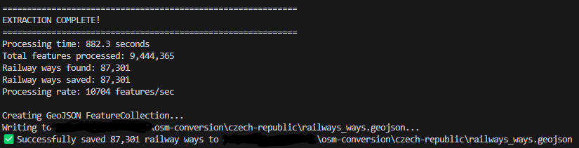
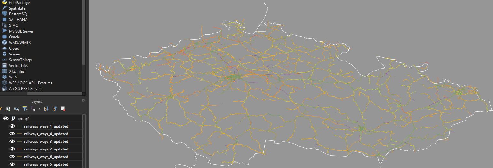

# Railroad Extraction from OpenStreetMaps

## Experimenting with AI

This was my experiment using generative AI to understand and process a large amount of data in a format I had never used before.
Specifically, this was my first time using the .pbf file type from [OpenStreetMap](https://www.openstreetmap.org/) (OSM).
I worked with a chatbot to understand how the data was structured and write code to extract, transform, and load the data.

### Code Provenance

All of the modules in this project were written by Claude Sonnet 4 or Cursor's Agent. The only changes I made are formatting the files with Black.
I directed the AI with all the features I needed. It took several iterations.

### Time Savings

It took me 4 hours from downloading the files to having processed several hundred megabytes of useful data from over a gigabyte of downloaded data. I do not have a comparison for working with a similar dataset without AI, but I was pleased with the workflow as a way to experiment with new data types.

## Problem Definition

Given a large package of OpenStreetMap data, such as an entire country from

[Geofabrik Downloads](https://download.geofabrik.de/)

extract all railways data and process it into a GeoJSON format. I focused on vector data of points (called Nodes by OSM) and polylines (called Ways by OSM).

## Results

1.3 GB of raw Chinese OSM data became 100 MB of railway points data (Nodes) and 263 MB of railway polyline data (Ways).

859 MB of raw Czech Republic data became 29 MB of railway points data and 71 MB of railway polyline data.

I am not including the raw data here nor the Chinese Railways Nodes file because they are too large for GitHub.

## Visualizations

## Module Overview (AI wrote the rest of this README about how to use the files)

This project consists of 5 sequential modules designed to extract and process railway data from OpenStreetMap PBF files. The modules are intentionally separated to provide checkpoints for computers with lower processing power or when working with particularly large datasets. Each module can be run independently after its prerequisites are met.

### Module 1: `1_osm_converter_nodes.py`

**Purpose**: Extracts railway nodes (points) from OSM PBF files and converts them to GeoJSON format.

**What it does**:

- Parses the entire OSM PBF file to identify railway-related nodes
- Identifies nodes with railway tags (railway=\*, public_transport=station, etc.)
- Caches all node coordinates for use in later modules
- Outputs `railways_nodes.geojson` containing railway point features

**Input**: OSM PBF file (e.g., `country.osm.pbf`)
**Output**: `railways_nodes.geojson`

### Module 2: `2_osm_converter_ways_without_coordinates.py`

**Purpose**: Extracts railway ways (lines/paths) from OSM PBF files without coordinates, storing only way IDs, tags, and node references.

**What it does**:

- Processes railway ways from the OSM PBF file
- Extracts way properties and node ID lists (but not coordinates)
- Creates placeholder geometry at (0,0) since GeoJSON requires geometry
- Outputs `railways_ways.geojson` with way data and node references

**Input**: OSM PBF file (e.g., `country.osm.pbf`)
**Output**: `railways_ways.geojson`

### Module 3: `3_split.py`

**Purpose**: Splits large railway ways files into smaller, manageable chunks for processing.

**What it does**:

- Takes the large `railways_ways.geojson` file
- Divides it into 6 smaller files (`railways_ways_1.geojson` through `railways_ways_6.geojson`)
- Enables parallel processing and reduces memory requirements

**Input**: `railways_ways.geojson`
**Output**: `railways_ways_1.geojson`, `railways_ways_2.geojson`, ..., `railways_ways_6.geojson`

### Module 4: `4_assign_coordinates_to_ways.py`

**Purpose**: Assigns real coordinates to railway ways by looking up node coordinates from the original PBF file.

**What it does**:

- Collects all unique node IDs from the split ways files
- Extracts coordinates for these specific nodes from the original PBF file
- Updates each way's geometry with actual LineString or Point coordinates
- Outputs updated files (`railways_ways_1_updated.geojson`, etc.)

**Input**: Split ways files + original OSM PBF file
**Output**: `railways_ways_1_updated.geojson`, `railways_ways_2_updated.geojson`, etc.

### Module 5: `5_segment_missing_coordinates.py` _(Optional)_

**Purpose**: Identifies and separates ways that still have missing or invalid coordinates after step 4.

**What it does**:

- Analyzes all updated ways files for features with missing coordinates
- Creates a separate file (`railways_ways_missing_coordinates.geojson`) containing problematic features
- Creates clean files (`railways_ways_valid_1.geojson`, etc.) with only valid coordinates
- **Note**: This module is only necessary if there are missing nodes after step 4

**Input**: Updated ways files from step 4
**Output**:

- `railways_ways_missing_coordinates.geojson` (problematic features)
- `railways_ways_valid_1.geojson`, `railways_ways_valid_2.geojson`, etc. (clean data)

### Optional Module: `prettify.py`

**Purpose**: Formats GeoJSON files with proper indentation for human readability.

**What it does**:

- Adds whitespace and indentation to GeoJSON files
- Makes files easier to read and debug
- **Warning**: Significantly increases file size and memory usage due to added whitespace
- **Note**: This module is not necessary for data processing and should only be used for debugging or final presentation

**Input**: Any GeoJSON file
**Output**: Prettified version of the same file

## Usage Workflow

0. **Gather Raw Data**: Download the raw data and set `config.py`
1. **Run Module 1**: Extract railway nodes
2. **Run Module 2**: Extract railway ways (without coordinates)
3. **Run Module 3**: Split ways file into manageable chunks
4. **Run Module 4**: Assign coordinates to ways
5. **Run Module 5**: _(Only if needed)_ Clean up missing coordinates
6. **Run prettify.py**: _(Optional)_ Format files for readability

## Configuration

All modules use `config.py` for file paths and settings. Update the configuration file to specify your input PBF file and output directory before running any modules.
